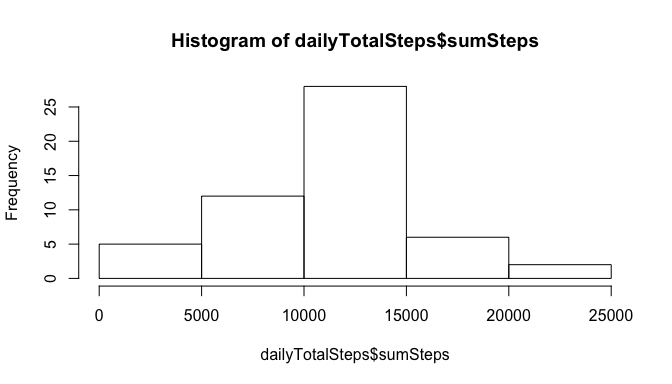
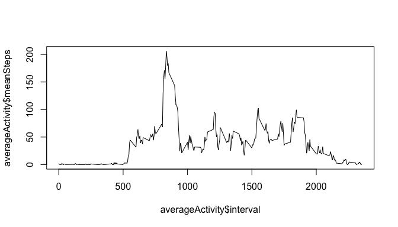
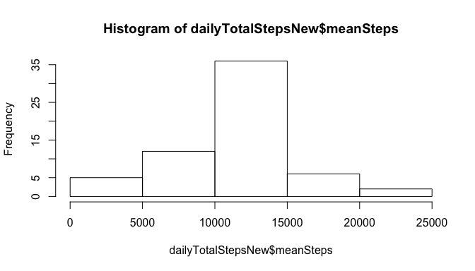
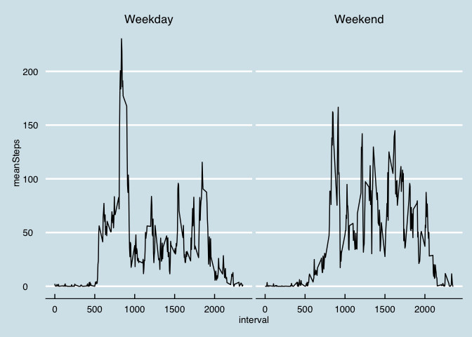

# Reproducible Research: Peer Assessment 1


### 1. Loading and processing the data

*Show any code that is needed to*
*Load the data (i.e. read.csv())*
*Process/transform the data (if necessary) into a format suitable for your analysis*


We just read the data into the data frame `data`, and then get rid of rows which contain missing values in the form of `NA`. We shall create another dataset called `dataPruned` which is going to contain 


```r
unzip("activity.zip")
data <- read.csv("activity.csv")
toKeep <- complete.cases(data)
dataPruned <- data[toKeep, ]
```

#### 1.1. Calculation of the number of steps taken per day 

*For this part of the assignment, you can ignore the missing values in the dataset.*

This just calculates the steps and prints the value as a table. We shall print the first few data points so that it is easy to see what the data looks like in a table. 


```r
library(dplyr)
library(xtable)
dailyTotalSteps <- dataPruned      %>% 
                   group_by(date)  %>% 
                   summarize( sumSteps = sum(steps) )
xt <- xtable( head(dailyTotalSteps) )
print (xt, type="html", floating=F, include.rownames = F)
```

<!-- html table generated in R 3.1.2 by xtable 1.7-4 package -->
<!-- Sun Jul 19 20:42:25 2015 -->
<table border=1>
<tr> <th> date </th> <th> sumSteps </th>  </tr>
  <tr> <td> 2012-10-02 </td> <td align="right"> 126 </td> </tr>
  <tr> <td> 2012-10-03 </td> <td align="right"> 11352 </td> </tr>
  <tr> <td> 2012-10-04 </td> <td align="right"> 12116 </td> </tr>
  <tr> <td> 2012-10-05 </td> <td align="right"> 13294 </td> </tr>
  <tr> <td> 2012-10-06 </td> <td align="right"> 15420 </td> </tr>
  <tr> <td> 2012-10-07 </td> <td align="right"> 11015 </td> </tr>
   </table>


#### 1.2. Make a histogram of the total number of steps taken each day


```r
hist(dailyTotalSteps$sumSteps, breaks=6)
```

 

#### 1.3. The mean and the median for the total setps taken per day


```r
meanTotalSteps   <- mean(   dailyTotalSteps$sumSteps )
medianTotalSteps <- median( dailyTotalSteps$sumSteps )

sprintf("The mean total steps taken per day = %f", meanTotalSteps)
```

```
## [1] "The mean total steps taken per day = 10766.188679"
```

```r
sprintf("The median total steps taken per day = %f", medianTotalSteps)
```

```
## [1] "The median total steps taken per day = 10765.000000"
```

### 2. The average daily activity pattern

#### 2.1. Make a time series plot (i.e. type = "l") of the 5-minute interval (x-axis) and the average number of steps taken, averaged across all days (y-axis)


```r
averageActivity <- dataPruned         %>% 
                   group_by(interval) %>% 
                   summarize( meanSteps = mean( steps ) )
plot(averageActivity$interval, averageActivity$meanSteps, type="l")
```

 

As can be seen, there is a clear peak in the value of the mean activity around the 800 value. Lets find that value ...

#### 2.2. Which 5-minute interval, on average across all the days in the dataset, contains the maximum number of steps?

It turns out that this value is at the 835 minute mark. 


```r
maxTime <- averageActivity$interval[ averageActivity$meanSteps == max(averageActivity$meanSteps) ]
sprintf("The position of the peak is at interval : %d", maxTime)
```

```
## [1] "The position of the peak is at interval : 835"
```

### 3. Imputing missing values

#### 3.1. Finding the number of rows with missing values. 

Missing values ...

Earlier on, there was already a variable defined as `toKeep`. This is a vector of `TRUE`-`FALSE` items determining which ones are *not* `NA`. So all we have to do is to calculate the sum of values which are a complement of these values. So the number of values whuch have `NA` values are simply:


```r
sprintf("The number of NAs in the dataset are: %d.", sum(!toKeep))
```

```
## [1] "The number of NAs in the dataset are: 2304."
```


#### 3.2. Fill the missing values

*Devise a strategy for filling in all of the missing values in the dataset. The strategy does not need to be sophisticated. For example, you could use the mean/median for that day, or the mean for that 5-minute interval, etc. Create a new dataset that is equal to the original dataset but with the missing data filled in.*

Over here, we can consider filling the values with the mean for the 5 minute interval which we already calculated. We can do that in the following way ...

 - First, get the values which have `NA`s in the data. Call it `dataPruned1`
 - Then, make the `steps` for an `interval` equal to the `meanSteps` calculated above.
 - Finally combine the data frames `dataPruned` and `dataPruned1` to a single dataset.
 - remember to sort them properly. 


```r
dataPruned1 <- data[!toKeep, ]
for (i in 1:length(averageActivity$interval)) {
    dataPruned1[ dataPruned1$interval == averageActivity$interval[i]  , "steps"] = averageActivity$meanSteps[i]
}

combined <- rbind( dataPruned, dataPruned1 ) %>% arrange(date, interval)
```

#### 3.3. Calculating the histogram, mean and total steps again

*Make a histogram of the total number of steps taken each day and Calculate and report the mean and median total number of steps taken per day. Do these values differ from the estimates from the first part of the assignment? What is the impact of imputing missing data on the estimates of the total daily number of steps?*


```r
dailyTotalStepsNew <- combined        %>% 
                      group_by(date)  %>% 
                      summarize( meanSteps = sum(steps) )

hist(dailyTotalStepsNew$meanSteps, breaks=6)
```

 

```r
meanTotalStepsNew   <- mean(   dailyTotalStepsNew$meanSteps )
medianTotalStepsNew <- median( dailyTotalStepsNew$meanSteps )

sprintf("The mean total steps taken per day = %f", meanTotalStepsNew)
```

```
## [1] "The mean total steps taken per day = 10766.188679"
```

```r
sprintf("The median total steps taken per day = %f", medianTotalStepsNew)
```

```
## [1] "The median total steps taken per day = 10766.188679"
```

Interesting. After doing the transformation, the mean and the median show exactly the same number, and is equal to the previous value of the mean. 

### 4. Weekdays vs Weekends

#### 4.1. Create a factor variable

*Are there differences in activity patterns between weekdays and weekends?For this part the weekdays() function may be of some help here. Use the dataset with the filled-in missing values for this part.Create a new factor variable in the dataset with two levels -- "weekday" and "weekend" indicating whether a given date is a weekday or weekend day.*

First we change the `combined$date` column from a `string` to a `Date`. Then we add another column to create a factor variable denoting the weekday and weekend. This is called `dayType`


```r
# Convert the date to the date type 
combined$date <- as.Date(combined$date)

#Create a columns that is the day of the week 
combined$Weekday <- weekdays( combined$date )

# Use this newly created column to create a new column says if the date is a weekday or a weekend
isWeekEnd <- combined$Weekday == 'Saturday' | combined$Weekday == 'Sunday'
combined$isWeenend[isWeekEnd] = "Weekend"
combined$isWeenend[!isWeekEnd] = "Weekday"

# Create a factor variable using this new variable ...
combined$dayType <- factor(combined$isWeenend, levels=c("Weekday", "Weekend"))
```

#### 4.1. Plot mean for weedday vs. weekend

*Make a panel plot containing a time series plot (i.e. type = "l") of the 5-minute interval (x-axis) and the average number of steps taken, averaged across all weekday days or weekend days (y-axis). The plot should look something like the following, which was created using simulated data:*

We now group by both the `dayType` and the `interval` and find the mean of the steps as a function of the `interval` and the `dayType`. This is the new dataset which we want to work with. We shall call this `meanNew`. Once this is done, creating the plot is relatively simple. 


```r
library(ggplot2)
```

```
## Warning: package 'ggplot2' was built under R version 3.1.3
```

```r
library(ggthemes)
```

```
## Warning: package 'ggthemes' was built under R version 3.1.3
```

```r
meanNew <- combined %>% group_by( dayType, interval ) %>% summarize( meanSteps = mean(steps) )
ggplot(meanNew, aes(interval, meanSteps)) +
    facet_wrap(~dayType) +
    geom_line() +
    theme_economist() + 
    scale_colour_economist()
```

 

